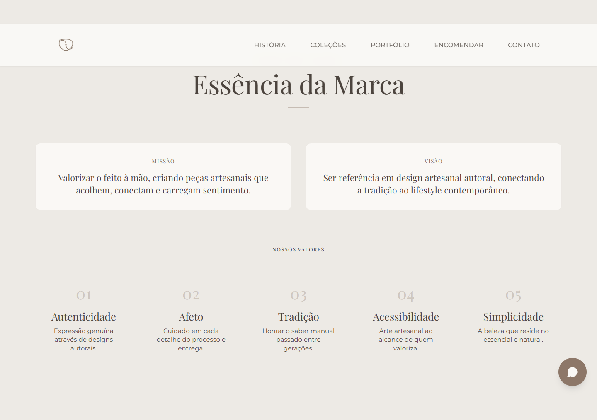
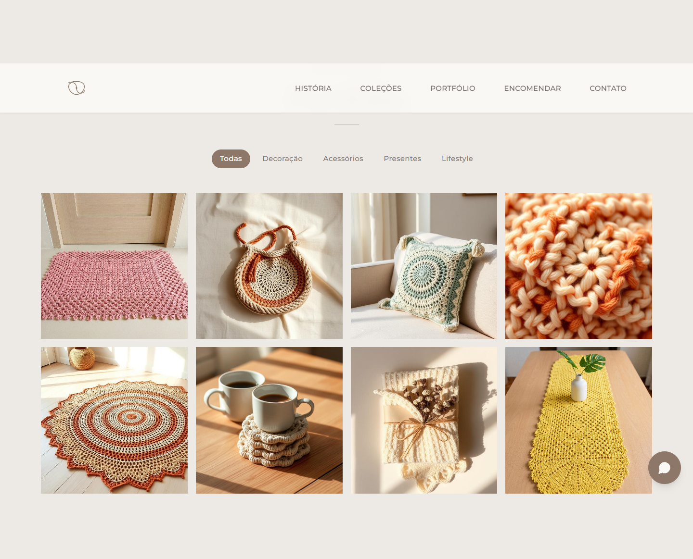

#  Tenua Studio Showcase

> **⚠️ DOCUMENTO DE USO ESTRITAMENTE INTERNO**
> Este repositório contém o código-fonte proprietário da vitrine digital da Tenua. A distribuição não autorizada é proibida.

---

## 🏢 Visão Geral do Produto

O **Tenua Studio Showcase** é o principal ponto de contato digital entre o Ateliê Tenua e seus clientes de alto valor.

**Problema de Negócio:** Anteriormente, o processo de vendas dependia exclusivamente do atendimento via WhatsApp/Instagram, sem um catálogo consolidado ou presença de marca que refletisse o posicionamento "premium/artesanal" da empresa.

**Solução:** Uma aplicação web de alta performance que serve como:
1.  **Catálogo Vivo:** Apresentação dinâmica de produtos (Bolsas, Mantas, Tapetes).
2.  **Brand Experience:** Transmissão dos valors da marca (Feito à mão, Tempo, Dedicação).
3.  **Funnel de Conversão:** Direcionamento qualificado para o WhatsApp Comercial.

**Público Alvo:** Clientes finais (B2C) em busca de decoração de luxo e peças exclusivas.

---

## 🏗️ Arquitetura e Decisões Técnicas

A stack foi escolhida priorizando **estabilidade, performance e manutenibilidade** a longo prazo.

### Frontend (SPA)
*   **React 18 + TypeScript:** Tipagem estrita é obrigatória para reduzir bugs em runtime e facilitar o onboarding de novos devs.
*   **Vite:** Build tool escolhida pela velocidade de HMR (Hot Module Replacement) e otimização de bundle.
*   **Tailwind CSS + Shadcn/UI:** Padronização visual sem "reinventar a roda". O Design System segue tokens estritos (cores, espaçamentos) definidos no Figma.
*   **TanStack Query:** Gerenciamento de estado de servidor (assíncrono) para separar a camada de dados da UI.

### Infraestrutura & CI/CD
*   **Hospedagem:** Vercel (Frontend Cloud) para edge caching global.
*   **Pipeline:** CI via GitHub Actions (lint e build) e CD automático na branch `main`.

---


## ⚙️ Ambiente de Desenvolvimento (Onboarding)

Siga este guia estrito para configurar seu ambiente.

### 1. Pré-requisitos
*   **Node.js**: `v18.17.0` ou superior (Sugerimos usar `nvm` ou `volta`).
*   **Package Manager**: `npm` (padrão do projeto) ou `bun` (aprovado para CI local).
*   **Editor**: VS Code com extensões: *ESLint, Prettier, Tailwind CSS IntelliSense*.

### 2. Configuração de Variáveis
⚠️ **NUNCA comite chaves de API ou segredos no repositório.**

Copie o exemplo para criar seu arquivo local:
```bash
cp .env.example .env
```

Edite o `.env` com as chaves de desenvolvimento (solicite ao Tech Lead se necessário):
```env
VITE_API_URL=http://localhost:3000
VITE_WHATSAPP_NUMBER=55 99 9999-9999
```

### 3. Instalação e Execução
```bash
# Instalar dependências (clean install recomendado)
npm ci

# Rodar servidor local
npm run dev
```

O sistema estará disponível em: `http://localhost:8080`

---

## 🤖 Scripts e Automação

Utilize os scripts padronizados no `package.json` para manter a qualidade do código.

| Comando | Função | Quando usar |
| :--- | :--- | :--- |
| `npm run dev` | Inicia servidor de desenvolvimento | Durante a codificação diária |
| `npm run build` | Gera build de produção (`/dist`) | Antes de abrir Pull Request |
| `npm run preview` | Testa o build de produção localmente | Para verificar assets/caminhos pós-build |
| `npm run lint` | Roda ESLint + verificação de tipos | **Obrigatório** antes de commitar |

---

## 📸 Galeria da Aplicação

### 🏠 Home & Hero


### 🧶 História & Essência
| História | Essência |
| :---: | :---: |
|  |  |

### 👜 Coleções


### 🖼️ Portfólio


### 📦 Encomendas


### ℹ️ Suporte
| Cuidados | FAQ |
| :---: | :---: |
|  |  |

### 📞 Contato


---

## 🚀 Fluxo de Deploy

O deploy é automatizado via integração Vercel <-> GitHub.
1.  **Feature Branches**: Deploies de preview gerados automaticamente a cada PR.
2.  **Main Branch**: Deploy de produção imediato após merge aprovado.

**Regra de Ouro:** A branch `main` deve estar sempre "deployable". Bloqueio de merge se o `npm run build` falhar.

---

## 🛡️ Backups e Alertas

### Backups
*   Snapshot local: `npm run backup` cria cópia de `src/`, `public/` e configs em `backups/<timestamp>/`.
*   Manifesto: cada snapshot possui `manifest.json` com itens incluídos e data/hora.
*   Recomendações: configurar backup externo (S3/Bucket) com retenção; subir via CI com credenciais em `Secrets`.

### Healthcheck
*   Endpoint estático: `public/healthcheck.json` acessível em `/healthcheck.json` com status básico.
*   Use este endpoint em monitores externos (Ping/HTTP).

### Monitoramento de Uptime (GitHub Actions)
*   Workflow: `.github/workflows/uptime-monitor.yml` verifica disponibilidade a cada 15 minutos.
*   Variável necessária: defina `SITE_URL` em **Repository Variables** para o domínio de produção.
*   Incidentes: em falha, abre uma Issue com detalhes do status HTTP e timestamp.

### CI de Qualidade
*   Workflow: `.github/workflows/ci.yml` roda `npm ci`, `npm run lint` e `npm run build` em push/PR para `main`.
*   Node: versão 18 conforme pré-requisito.

---

## 👨‍💻 Autoria e Manutenção

**Tenua Engineering Team**

*   **Tech Lead:** Zacarias Ramos
*   **Frontend Eng:** Zacarias Ramos
*   **Design:** Zacarias Ramos

---

<div align="center">
  <p>© 2026 Tenua. Todos os direitos reservados.</p>
  <p><i>Uso estritamente interno e proprietário. Não divulgar.</i></p>
</div>
